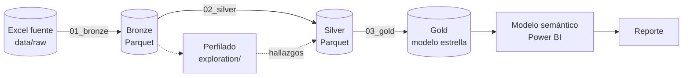

# Arquitectura

| | |
|---|---|
| **Proyecto** | Seguimiento de accidentes en carreteras federales |
| **Responsable** | Equipo de Analytics |
| **Versión** | 1.1 |
| **Fecha** | 2026-10-07 |

## Flujo de datos

## Capas

| Capa | Ubicación | Formato | Contenido | Proceso |
|---|---|---|---|---|
| Raw | `data/raw/` | Excel | Archivo fuente, no se modifica | Entrega manual |
| Bronze | `data/bronze/` | Parquet | Copia fiel de la fuente más columnas de auditoría | `etl/01_bronze.ipynb` |
| Silver | `data/silver/` | Parquet | Una tabla limpia, tipada y validada | `etl/02_silver.ipynb` |
| Gold | `data/gold/` | Parquet | Hecho de accidentes y dimensiones | `etl/03_gold.ipynb` |
| Semántica | `powerbi/` | PBIP | Relaciones y medidas DAX | Power BI Desktop |

El detalle de las transformaciones está en [`03_mapeo_fuente_destino.md`](03_mapeo_fuente_destino.md).

## Herramientas

| Componente | Herramienta |
|---|---|
| Transformación | Python, pandas |
| Almacenamiento | Parquet (pyarrow) |
| Desarrollo | Jupyter en VS Code |
| Modelo y reporte | Power BI Desktop, formato PBIP |
| Control de versiones | Git, GitHub |

## Decisiones de diseño

| Decisión | Motivo |
|---|---|
| pandas y Parquet en local, sin motor distribuido | El volumen (60.531 filas) no lo requiere. La lógica es portable a PySpark |
| Carga completa en cada ejecución | La fuente es estática y pequeña; no se justifica una carga incremental |
| Las capas bronze, silver y gold no se versionan | Se regeneran ejecutando los notebooks. Solo se versionan la fuente y el código |
| El perfilado vive fuera del pipeline | Es un análisis puntual para definir reglas; el pipeline solo transforma y valida |
| Validaciones con `assert` antes de escribir | Si una regla falla, el notebook se detiene y no se genera el archivo |
| Reporte en PBIP y no en PBIX | El modelo y el reporte quedan como texto, y Git muestra los cambios |
| Power BI lee solo de gold | La lógica de transformación queda en el ETL |
| Una sola ruta local, en el parámetro `RutaProyecto` | Power Query no admite rutas relativas. Al clonar el proyecto se cambia un único valor |

## Ejecución

Manual, en este orden:

1. `etl/01_bronze.ipynb`
2. `etl/02_silver.ipynb`
3. `etl/03_gold.ipynb`
4. Abrir el reporte en Power BI Desktop, apuntar el parámetro `RutaProyecto` a la carpeta del repositorio y actualizar el modelo

`exploration/01_perfilado_bronze.ipynb` se ejecuta solo cuando cambia la fuente.

## Convenciones

- Carpetas en inglés; archivos y contenido en español.
- Columnas en snake_case, en español y sin acentos, a partir de silver.
- Las columnas de auditoría llevan el prefijo `_`.
- Notebooks numerados según el orden de ejecución.

## Fuera de esta versión

- Orquestación automática de los notebooks
- Despliegue en nube
- Pruebas automáticas en integración continua

## Control de cambios

| Versión | Fecha | Cambio |
|---|---|---|
| 1.0 | 2026-10-06 | Versión inicial |
| 1.1 | 2026-10-07 | Se documenta el parámetro `RutaProyecto` |
