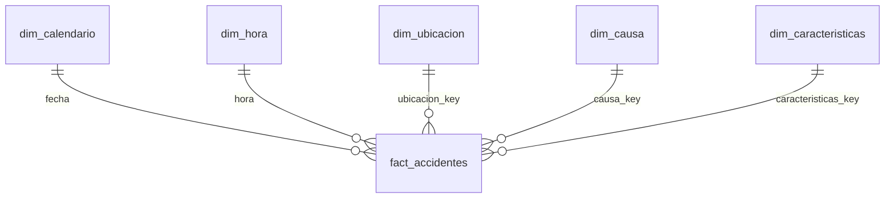

# Diccionario de datos

| | |
|---|---|
| **Proyecto** | Seguimiento de accidentes en carreteras federales |
| **Responsable** | Equipo de Analytics |
| **Versión** | 1.0 |
| **Fecha** | 2026-10-07 |

Describe las tablas de la capa gold, que es la única que consume el modelo semántico de Power BI. Las genera `etl/03_gold.ipynb` a partir de silver y se guardan en `data/gold/`, un archivo Parquet por tabla.

## Modelo

| Tabla | Tipo | Grano | Filas |
|---|---|---|---|
| `fact_accidentes` | Hecho | Un accidente | 60.531 |
| `dim_calendario` | Dimensión | Un día | 1.096 |
| `dim_hora` | Dimensión | Una hora del día | 24 |
| `dim_ubicacion` | Dimensión | Un estado | 4 |
| `dim_causa` | Dimensión | Una causa de accidente | 44 |
| `dim_caracteristicas` | Dimensión | Una combinación de clasificación y tipo de carril | 9 |

## fact_accidentes

Accidentes ocurridos en carreteras federales entre 2018 y 2020.

| Columna | Tipo | Llave | Descripción | Ejemplo |
|---|---|---|---|---|
| `accidente_id` | Entero | PK | Identificador del accidente en la fuente | 262002 |
| `fecha` | Fecha | FK a `dim_calendario` | Fecha del accidente | 2020-01-10 |
| `hora` | Entero | FK a `dim_hora` | Hora del día en que ocurrió, de 0 a 23, sin minutos | 21 |
| `ubicacion_key` | Entero | FK a `dim_ubicacion` | Estado donde ocurrió | 4 |
| `causa_key` | Entero | FK a `dim_causa` | Causa principal del accidente | 23 |
| `caracteristicas_key` | Entero | FK a `dim_caracteristicas` | Clasificación del accidente y tipo de carril | 4 |
| `muertos` | Entero | | Personas fallecidas en el accidente | 0 |
| `heridos` | Entero | | Personas heridas en el accidente, leves y graves | 1 |
| `latitud` | Decimal | | Latitud del lugar del accidente, en grados decimales | -22.531582 |
| `longitud` | Decimal | | Longitud del lugar del accidente, en grados decimales | -44.753747 |

## dim_calendario

Un día por fila, con los años completos que cubren los datos: del 1 de enero de 2018 al 31 de diciembre de 2020. No depende de que haya accidentes en la fecha.

| Columna | Tipo | Llave | Descripción | Ejemplo |
|---|---|---|---|---|
| `fecha` | Fecha | PK | Día calendario | 2019-07-03 |
| `anio` | Entero | | Año | 2019 |
| `trimestre` | Entero | | Trimestre del año, de 1 a 4 | 3 |
| `mes` | Entero | | Número del mes, de 1 a 12. Ordena `nombre_mes` | 7 |
| `nombre_mes` | Texto | | Nombre abreviado del mes | Jul |
| `dia_semana` | Entero | | Número del día de la semana, de 1 (lunes) a 7 (domingo). Ordena `nombre_dia_semana` | 3 |
| `nombre_dia_semana` | Texto | | Nombre abreviado del día de la semana | Mié |

## dim_hora

Las 24 horas del día.

| Columna | Tipo | Llave | Descripción | Ejemplo |
|---|---|---|---|---|
| `hora` | Entero | PK | Hora del día, de 0 a 23 | 6 |
| `etiqueta` | Texto | | Hora en formato de reloj, para ejes y filtros | 06:00 |

## dim_ubicacion

Estados de la región sudeste de Brasil incluidos en el análisis.

| Columna | Tipo | Llave | Descripción | Ejemplo |
|---|---|---|---|---|
| `ubicacion_key` | Entero | PK | Llave subrogada | 4 |
| `estado_sigla` | Texto | | Sigla del estado: ES, MG, RJ o SP | SP |
| `estado` | Texto | | Nombre del estado | São Paulo |

## dim_causa

Causa principal registrada para cada accidente.

| Columna | Tipo | Llave | Descripción | Ejemplo |
|---|---|---|---|---|
| `causa_key` | Entero | PK | Llave subrogada | 23 |
| `causa_accidente` | Texto | | Descripción de la causa | Falta de atención de conducción |

## dim_caracteristicas

Combinaciones de clasificación del accidente y tipo de carril presentes en los datos.

| Columna | Tipo | Llave | Descripción | Ejemplo |
|---|---|---|---|---|
| `caracteristicas_key` | Entero | PK | Llave subrogada | 4 |
| `clasificacion_accidente` | Texto | | Gravedad del accidente: Con víctimas fatales, Con víctimas heridas o Sin víctimas | Con víctimas heridas |
| `tipo_carril` | Texto | | Tipo de vía: Doble, Múltiple o Simple | Doble |

## Reglas generales

- Ninguna columna admite nulos.
- Todas las relaciones son de uno a muchos, de la dimensión al hecho.
- Las llaves subrogadas se asignan por orden alfabético de los valores y se regeneran en cada ejecución. No deben usarse fuera de gold como identificadores permanentes.
- `fecha` y `hora` son llaves naturales: el hecho y su dimensión comparten el mismo valor.
- Los atributos de silver que el reporte no usa (municipio, tipo de accidente, sentido de la vía y el detalle de personas y vehículos) no se cargan en gold.

## Control de cambios

| Versión | Fecha | Cambio |
|---|---|---|
| 1.0 | 2026-10-07 | Versión inicial |
